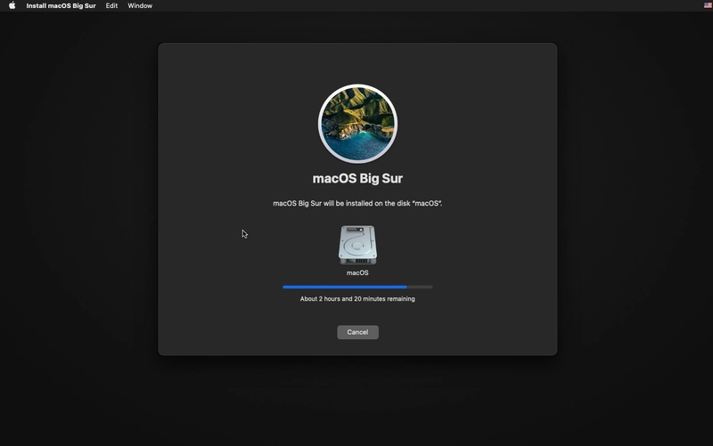

# Instalar MacOS mediante docker

Para poder ejecutar esta emulación del sistema operativo MacOS se sugiere el siguiente hardware:

- 16 GB de RAM.
- 20 GB de almacenamiento disponible (50 GB si se planea descargar xcode). 
- Procesador que permita virtualización.

Además, se deben de tener las siguientes herramientas instaladas:

- Docker 

Si se piensa ejecutar con el sistema operativo de windows, se requiere:

- Docker Desktop (si se piensa ejecutar en windows).
- WSL.
- Ubuntu (o cualquier otra distribución ejecutada sobre WSL).

# Instalación

## Windows

Primero, debe de activarse dentro de docker Deskop la opción de habilitar la distribución por defecto de WSL, esto se encuentra dentro de `settings > resources > WSL Integration`, aquí deberá activarse la casilla de `Enable integration with my default WSL distro` y seleccionar la distribución a utilizar.


Dentro de la distribución, se deberá de editar el archivo .wslconfig, esto se puede con el siguiente comando:

```bash
nano /mnt/c/Users/<tu_nombre>/.wslconfig
```

El contenido del archivo estará en blanco, en este archivo se agregará lo siguiente:
 
```bash
[wsl2]
nestedVirtualization=true
```

Luego, debe de verificarse si KVM está en buen estado con el comando `kvm-ok`, donde la salida debe ser la siguiente:

```bash
INFO: /dev/kvm exists
KVM acceleration can be used
```

En caso de tener otra salida, ejecutar lo siguiente: `sudo apt -y install bridge-utils cpu-checker libvirt-clients libvirt-daemon qemu qemu-kvm` y volver a verificar con `kvm-ok`

Una vez instalado, hay que asegurarse de correr el siguiente comando para poder visualizar ventanas que se generen de nuestra distribución:

```bash
sudo apt install x11-apps -y
```

Ya finalmente, debe de ejecutarse el siguiente comando:

```bash
 docker run -it \
    --device /dev/kvm \
    -p 50922:10022 \
    -e "DISPLAY=${DISPLAY:-:0.0}" \
    -v /mnt/wslg/.X11-unix:/tmp/.X11-unix \
    -e GENERATE_UNIQUE=true \
    -e MASTER_PLIST_URL='https://raw.githubusercontent.com/sickcodes/osx-serial-generator/master/config-custom.plist' \
    -e SHORTNAME=ventura \
    -e RAM=8 \
    -e SMP=8 \
    -e CORES=4 \
    sickcodes/docker-osx:latest
```

Si no funciona, ejecutar este otro:

```bash
 docker run -it \
    --device /dev/kvm \
    -p 50922:10022 \
    -e "DISPLAY=${DISPLAY:-:0}" \
    -v /mnt/wslg/.X11-unix:/tmp/.X11-unix \
    -e GENERATE_UNIQUE=true \
    -e MASTER_PLIST_URL='https://raw.githubusercontent.com/sickcodes/osx-serial-generator/master/config-custom.plist' \
    -e SHORTNAME=ventura \
    -e RAM=8 \
    -e SMP=8 \
    -e CORES=4 \
    sickcodes/docker-osx:latest
```

## Linux

Primero, deben de instalarse algunos paquetes con el siguiente comando:

```bash
sudo pacman -S qemu libvirt dnsmasq virt-manager bridge-utils flex bison iptables-nft edk2-ovmf # Si se utiliza arch

sudo apt install qemu qemu-kvm libvirt-clients libvirt-daemon-system bridge-utils virt-manager libguestfs-tools # Si se utiliza debian/ubuntu

sudo yum install libvirt qemu-kvm # Fedora
```

Luego, se debe habilitar la virtualización con KVM:

```bash
sudo systemctl enable --now libvirtd
sudo systemctl enable --now virtlogd

echo 1 | sudo tee /sys/module/kvm/parameters/ignore_msrs

sudo modprobe kvm
```

Una vez todo esté configurado, ejecutar el siguiente comando:

```bash
 docker run -it \
    --device /dev/kvm \
    -p 50922:10022 \
    -v /tmp/.X11-unix:/tmp/.X11-unix \
    -e "DISPLAY=${DISPLAY:-:0.0}" \
    -e GENERATE_UNIQUE=true \
    -e MASTER_PLIST_URL='https://raw.githubusercontent.com/sickcodes/osx-serial-generator/master/config-custom.plist' \
    -e SHORTNAME=ventura \
    -e RAM=8 \
    -e SMP=8 \
    -e CORES=4 \
    sickcodes/docker-osx:latest
```

# Configuración de MacOS

Primero, se tendrá un menú con dos opciones, el sistema base de MacOS y el UEFI Shell, se escogerá la opción de MacOS base system:


Luego, se debe seleccionar la opción de disk utility.


El disco que se debe de utilizar es el que se llama QEMU, este tiene una capacidad de unas 270 GB.


Se hace clic derecho al disco de la barra lateral izquierda y se selecciona la opción de borrar, o bien, seleccionar la opción de borrar en los íconos de arriba.

Luego, se debe de renombrar el disco, por comodidad se nombrará "MacOS" y se selecciona el formato APFS y el esquema GUID Partition Map y se borra el disco.


Luego, se aceptan los términos y condiciones y se descarga el sistema, esto tarda alrededor de 1 hora.



Una vez instalado, este se debe de reiniciar, si no se reinicia, debe pararse el contenedor y volverse a iniciar. Se puede conocer el ID del contenedor con `docker ps -a`


Luego, se selecciona el disco MacOS Installer, para hacer la instalación del sistema sobre el disco.


Luego, volverá a reiniciarse el contenedor.


Una vez iniciado de nuevo, seleccionamos el disco que creamos.


Y seguimos con la instalación guiada de MacOS, omitiendo el paso de agregar el apple ID.


# Xcode

Para instalar Xcode es importante crear una cuenta de apple ID, esta puede hacerse de forma gratuita y rápido. En el siguiente link se encuentran las versiones de codeX y su compatibilidad, busca una versión que sea compatible con ventura (MacOS 13)

`https://xcodereleases.com/`